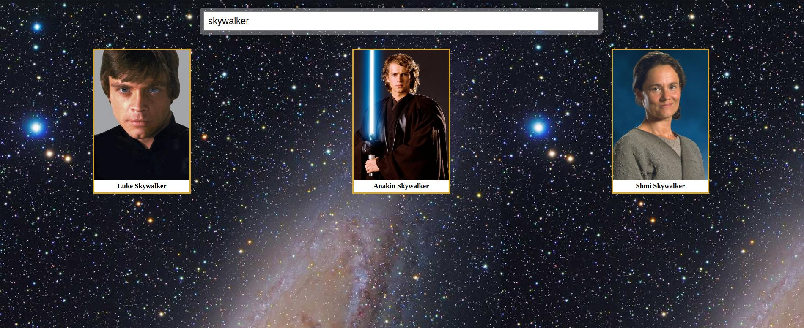
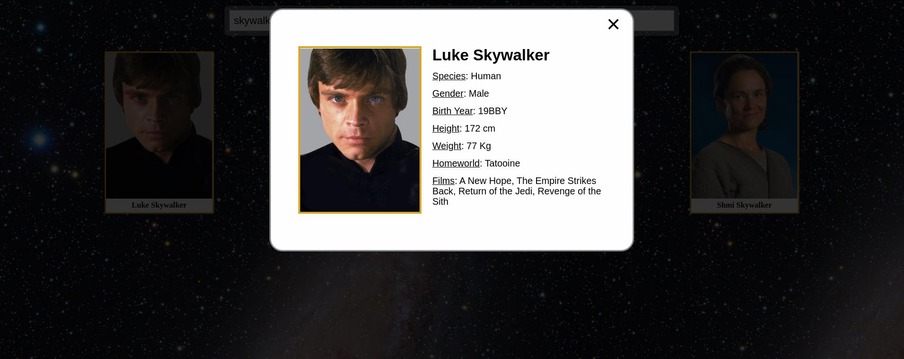

<!-- PROJECT SHIELDS -->
<!--
*** I'm using markdown "reference style" links for readability.
*** Reference links are enclosed in brackets [ ] instead of parentheses ( ).
*** See the bottom of this document for the declaration of the reference variables
*** for contributors-url, forks-url, etc. This is an optional, concise syntax you may use.
*** https://www.markdownguide.org/basic-syntax/#reference-style-links
-->

[![Contributors][contributors-shield]][contributors-url]
[![Forks][forks-shield]][forks-url]
[![Stargazers][stars-shield]][stars-url]
[![Issues][issues-shield]][issues-url]
[![LinkedIn][linkedin-shield]][linkedin-url]

<!-- PROJECT LOGO -->
<br />
<p align="center">
  <a href="https://github.com/sgtbrunner/star-wars-guide-react">
    
  </a>

  <h3 align="center">Star Wars Guide React</h3>

  <p align="center">
    A definitive Star Wars Character Guide featuring all characters from the original and prequel movie trilogies
    <br />
    <a href="https://github.com/sgtbrunner/star-wars-guide-react"><strong>Explore the docs »</strong></a>
    <br />
    <br />
    <a href="https://sgtbrunner.github.io/star-wars-guide-react/">View Demo</a>
    ·
    <a href="https://github.com/sgtbrunner/star-wars-guide-react/issues">Report Bug / Request Feature</a>
  </p>
</p>

<!-- TABLE OF CONTENTS -->
<details open="open">
  <summary>Table of Contents</summary>
  <ol>
    <li>
      <a href="#about-the-project">About The Project</a>
      <ul>
        <li><a href="#built-with">Built With</a></li>
      </ul>
    </li>
    <li>
      <a href="#getting-started">Getting Started</a>
      <ul>
        <li><a href="#prerequisites">Prerequisites</a></li>
        <li><a href="#installation">Installation</a></li>
      </ul>
    </li>
    <li><a href="#usage">Usage</a></li>
    <li><a href="#roadmap">Roadmap</a></li>
    <li><a href="#contributing">Contributing</a></li>
    <li><a href="#contact">Contact</a></li>
    <li><a href="#acknowledgements">Acknowledgements</a></li>
  </ol>
</details>

<!-- ABOUT THE PROJECT -->
## About The Project

[![Star Wars Guide React][product-screenshot]](https://sgtbrunner.github.io/star-wars-guide-react/)

Star Wars Guide React, inspired by [Star Wars Guide](https://sgtbrunner.github.io/star-wars-guide/), is the definitive Star Wars Character Guide, featuring all characters from the original and prequel movie trilogies.

This project was originally built as a pratical exercise to learning React, API integration and dialog implementation. Later on, the project was updated to hold fetched API data with Redux and testing with Jest and React Testing Library, delivering more content with better performance and increased confidence.  

### Built With

  Star Wars Guide React was built with the following technologies:

  <div>
    
    
    
    
    
    
  </div>
  <br />

<!-- GETTING STARTED -->
## Getting Started

To get a local copy up and running follow these simple example steps.

### Prerequisites

Have `npm` installed in your machine.  
* npm
  ```sh
  npm install npm@latest -g
  ```

### Installation
  On terminal

1. Clone the repo
   ```sh
   git clone https://github.com/sgtbrunner/star-wars-guide-react
   ```
2. Navigate to project folder
   ```sh
   cd star-wars-guide-react
   ```  
3. Install NPM packages
   ```sh
   npm install
   ```

<!-- USAGE EXAMPLES -->
## Usage
  Run the following commands on terminal within the project folder

1. Starting the app
   ```sh
   npm start
   ```
   If you browser doesn't open automatically, open it and navigate to
   ```sh
   http://localhost:3000/
   ```
    Once loaded, you can search for your favorite Star Wars characters and check their info:
    
    

2. Formatting the app
   ```sh
   npm run format
   ```

3. Linting the app
   ```sh
   npm run lint
   ```

4. Testing the app
   ```sh
   npm test
   ```

   To check for testing coverage:
   ```sh
   npm run test-coverage
   ```

5. Building the app
   ```sh
   npm run build
   ```

<!-- ROADMAP -->
## Roadmap
See the [open issues](https://github.com/sgtbrunner/star-wars-guide-react/issues) for a list of proposed features (and known issues).

<!-- CONTRIBUTING -->
## Contributing

Contributions are what make the open source community such an amazing place to be learn, inspire, and create. Any contributions you make are **greatly appreciated**.

1. Fork the Project
2. Create your Feature Branch (`git checkout -b feature/AmazingFeature`)
3. Commit your Changes (`git commit -m 'Add some AmazingFeature'`)
4. Push to the Branch (`git push origin feature/AmazingFeature`)
5. Open a Pull Request


<!-- CONTACT -->
## Contact

Guilherme Brunner - guilherme.brunner@gmail.com

Project Link: [https://github.com/sgtbrunner/star-wars-guide-react](https://github.com/sgtbrunner/star-wars-guide-react)


<!-- ACKNOWLEDGEMENTS -->
## Acknowledgements
* [Tachyons](https://tachyons.io/docs/)
* [The Star Wars API](https://swapi.dev/)
* [Star Wars Visual Guide](https://starwars-visualguide.com/)
* [React Prop-Types](https://www.npmjs.com/package/prop-types)
* [Redux-Thunk](https://github.com/reduxjs/redux-thunk)
* [Redux Persist](https://github.com/rt2zz/redux-persist)
* [Redux DevTools Extension](https://www.npmjs.com/package/redux-devtools-extension)
* [Eslint](https://eslint.org/)
* [Prettier](https://prettier.io/)
* [Testing Library](https://testing-library.com/)
* [Redux Mock Store](https://github.com/reduxjs/redux-mock-store)
* [GitHub Pages](https://pages.github.com)

<!-- MARKDOWN LINKS & IMAGES -->
<!-- https://www.markdownguide.org/basic-syntax/#reference-style-links -->
[contributors-shield]: https://img.shields.io/github/contributors/sgtbrunner/star-wars-guide-react.svg?style=for-the-badge
[contributors-url]: https://github.com/sgtbrunner/star-wars-guide-react/graphs/contributors
[forks-shield]: https://img.shields.io/github/forks/sgtbrunner/star-wars-guide-react.svg?style=for-the-badge
[forks-url]: https://github.com/sgtbrunner/star-wars-guide-react/network/members
[stars-shield]: https://img.shields.io/github/stars/sgtbrunner/star-wars-guide-react.svg?style=for-the-badge
[stars-url]: https://github.com/sgtbrunner/star-wars-guide-react/stargazers
[issues-shield]: https://img.shields.io/github/issues/sgtbrunner/star-wars-guide-react.svg?style=for-the-badge
[issues-url]: https://github.com/sgtbrunner/star-wars-guide-react/issues
[linkedin-shield]: https://img.shields.io/badge/-LinkedIn-black.svg?style=for-the-badge&logo=linkedin&colorB=555
[linkedin-url]: https://linkedin.com/in/guilherme-brunner
[product-screenshot]: src/assets/img/screenshot.jpg

